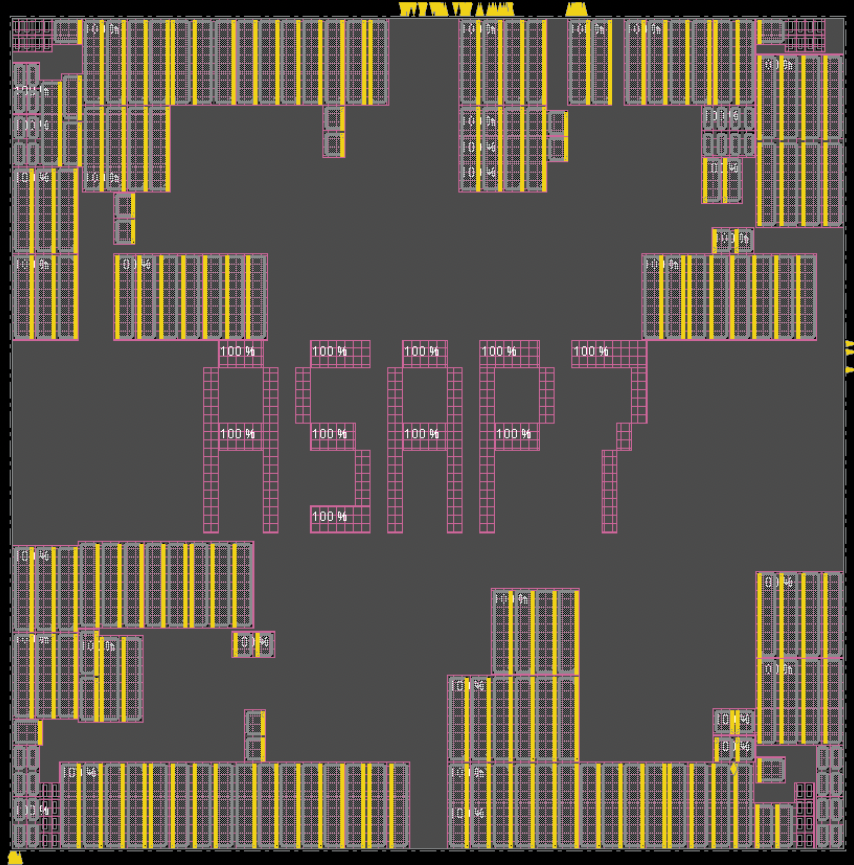

## Visualizations of the Second Set of Benchmarks 

**Please download the benchmarks from this [link](https://vlsicad.ucsd.edu/ISPD26-Contest/ispd26.html)**

These are visualizations of four public benchmarks with **placement blockages**. 

These visualizations are generated using an unnamed commercial tool.

### [aes_cipher_top_v2](./aes_cipher_top_v2/)

### [jpeg_encoder_v2](./jpeg_encoder_v2/)

### [ariane_v2](./ariane_v2/)

### [bsg_chip_v2](./bsg_chip_v2/)
